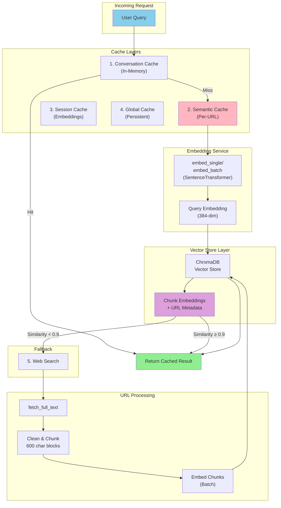

# Caching & Embeddings Architecture

## Overview

The system uses a **multi-layer caching strategy** combined with **semantic embeddings** to optimize retrieval performance and reduce redundant web searches.

## How Caching Works

### Cache Layers (Markov Chain Model)

The system implements a 5-layer cache hierarchy:

1. **Conversation Cache** - In-memory, session-specific responses
2. **Semantic Cache** - URL-based, query similarity matching (90% threshold)
3. **Session Cache** - Session-level embeddings
4. **Global Cache** - Persistent, cross-session storage
5. **Web** - Fallback for cache misses

**Cache Lookup Strategy:** Requests are checked sequentially from layers 1→5, with expected latency calculated as:
```

E[L] = Σ P(hit_i) × L_i + P(miss_all) × L_web
```

**TTL Configuration:**
- Default: 300 seconds
- Automatic cleanup of expired entries on startup and at runtime
- Per-request persistence using pickle

---

## How Embeddings Work Per URL

### Embedding Pipeline

```
URL Content → Fetch & Clean → Chunk Text (600 chars, 60 overlap)
    ↓
Embed Each Chunk (SentenceTransformer all-MiniLM-L6-v2)
    ↓
Store in VectorStore (ChromaDB) with URL Metadata
    ↓
Available for Semantic Similarity Matching
```

### Vector Storage
- **Model:** `sentence-transformers/all-MiniLM-L6-v2` (384-dimensional embeddings)
- **Storage Backend:** ChromaDB with persistent disk storage
- **Metadata per Chunk:** URL, chunk_id, timestamp
- **New Queries:** Compared against stored embeddings using cosine similarity

### Semantic Cache Matching
When a new query arrives:
1. Query is embedded using same model
2. Compared against all cached embeddings for URL
3. If similarity score ≥ 0.90, cached result returned
4. If similarity < 0.90, web search performed

---

## Architecture Diagram



---

## Key Features

| Feature | Configuration |
|---------|---|
| **Similarity Threshold** | 0.90 (90% match required) |
| **TTL** | 300 seconds (configurable) |
| **Embedding Model** | all-MiniLM-L6-v2 (384 dimensions) |
| **Chunk Size** | 600 characters with 60-char overlap |
| **Vector Backend** | ChromaDB (persistent storage) |
| **Thread Safety** | RLock-protected operations |

---

## Performance Benefit

- **Cache hits:** ~10-30ms (conversation/semantic)
- **Cache miss:** ~500-2000ms (web search + embedding)
- **Overall latency reduction:** Up to 70% with semantic cache hits
