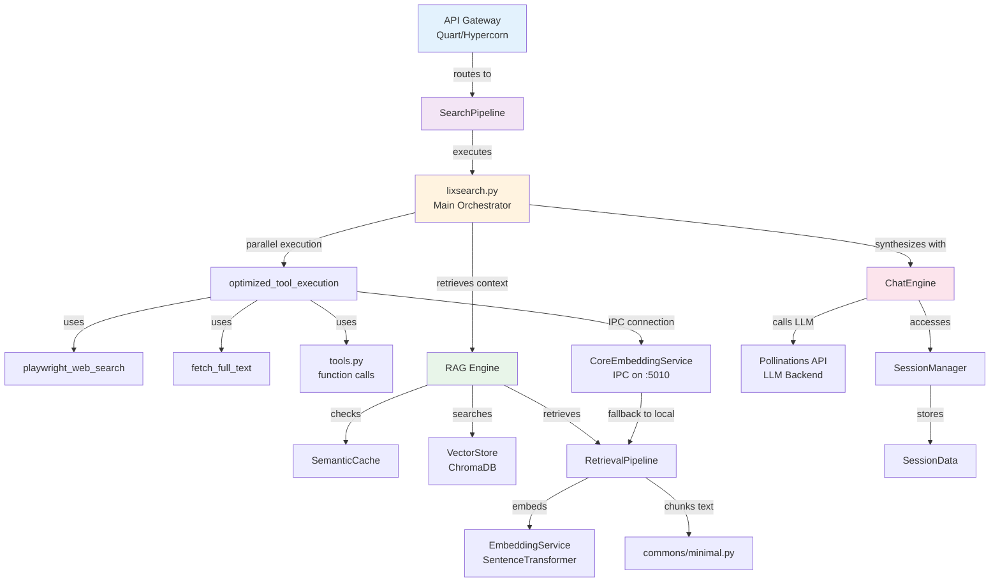
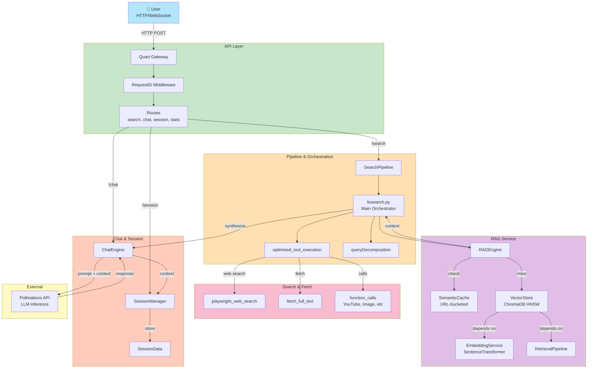

# lixSearch: Full System Architecture

## Table of Contents
1. [System Overview](#system-overview)
2. [Architectural Layers](#architectural-layers)
3. [Core Components](#core-components)
4. [Data Flow](#data-flow)
5. [Request Lifecycle](#request-lifecycle)
6. [Integration Architecture](#integration-architecture)
7. [Deployment Model](#deployment-model)

---

## System Overview

**lixSearch** is a multi-layered intelligent search system that combines:
- Real-time web search with streaming results
- Semantic RAG (Retrieval-Augmented Generation)
- Session-based context management
- LLM-powered synthesis
- Advanced caching strategies

### Key Goals
✅ Sub-second semantic matching through adaptive caching  
✅ Parallel query execution across multiple evidence sources  
✅ Cost optimization via token estimation and compression  
✅ Context-aware response synthesis using session memory  
✅ Graceful degradation when components fail  

---

## Architectural Layers

### Layer 1: API Gateway Layer (Quart/Hypercorn)

```
┌─────────────────────────────────────────┐
│         API Gateway Layer               │
├─────────────────────────────────────────┤
│  HTTP/WebSocket Server (Quart)          │
│  ├─ /api/search (POST/GET)              │
│  ├─ /api/chat (POST)                    │
│  ├─ /api/session/* (CRUD)               │
│  ├─ /api/health (GET)                   │
│  └─ /ws/search (WebSocket)              │
├─────────────────────────────────────────┤
│  Request Processing:                    │
│  • RequestIDMiddleware (X-Request-ID)   │
│  • CORS handling                        │
│  • Error handling & logging             │
│  • SSE (Server-Sent Events)             │
│  • OpenAI-compatible JSON formatting    │
└─────────────────────────────────────────┘
```

**Gateways:**
- `health.py` - Health checks
- `search.py` - Search endpoint (streaming SSE)
- `chat.py` - Chat with multi-turn context
- `session.py` - Session CRUD + KB operations
- `stats.py` - System statistics
- `websocket.py` - WebSocket streaming

**Key Features:**
- Streaming responses via Server-Sent Events (SSE)
- OpenAI-compatible response format
- Request ID tracking for tracing
- Async/await throughout with Quart

---

### Layer 2: Pipeline & Orchestration Layer

```
┌─────────────────────────────────────────────────────┐
│      Pipeline & Orchestration Layer                 │
├─────────────────────────────────────────────────────┤
│                                                     │
│  ┌───────────────────────────────────────────────┐ │
│  │  lixsearch.py: Main Pipeline Coordinator      │ │
│  ├───────────────────────────────────────────────┤ │
│  │ • Query decomposition (*_decompose_query)    │ │
│  │ • Tool orchestration (optimized_tool_exec)   │ │
│  │ • Response synthesis (system_instruction)    │ │
│  │ • Internal reasoning filtering               │ │
│  │ • Streaming SSE event generation             │ │
│  └───────────────────────────────────────────────┘ │
│                                                     │
│  ┌───────────────────────────────────────────────┐ │
│  │  searchPipeline.py: Execution Flow            │ │
│  ├───────────────────────────────────────────────┤ │
│  │ 1. Query validation & preprocessing           │ │
│  │ 2. Parallel tool execution coordination       │ │
│  │ 3. Result aggregation                         │ │
│  │ 4. LLM synthesis with context                 │ │
│  │ 5. Response streaming                         │ │
│  └───────────────────────────────────────────────┘ │
│                                                     │
│  ┌───────────────────────────────────────────────┐ │
│  │  optimized_tool_execution.py: Parallel Exec   │ │
│  ├───────────────────────────────────────────────┤ │
│  │ • Async execution of search tools             │ │
│  │ • Web search (Playwright)                     │ │
│  │ • YouTube video retrieval                     │ │
│  │ • Image analysis                              │ │
│  │ • Function calls (timezone, image gen, etc)   │ │
│  └───────────────────────────────────────────────┘ │
│                                                     │
│  ┌───────────────────────────────────────────────┐ │
│  │  Optimization Modules                         │ │
│  ├───────────────────────────────────────────────┤ │
│  │ • queryDecomposition.py (aspect detection)   │ │
│  │ • tokenCostOptimization.py (token counting) │ │
│  │ • formalOptimization.py (cost minimization) │ │
│  │ • adaptiveThresholding.py (dynamic filtering)│ │
│  └───────────────────────────────────────────────┘ │
│                                                     │
└─────────────────────────────────────────────────────┘
```

**Key Modules:**

#### lixsearch.py (Main Orchestrator)
```
run_elixposearch_pipeline(query, image, event_id, request_id)
    ├─ _decompose_query()  → break into sub-queries
    ├─ optimized_tool_execution() → parallel execution
    ├─ _get_rag_context() → retrieve cached evidence
    ├─ LLM synthesis → generate response
    └─ SSE streaming → yield formatted events
```

#### searchPipeline.py (Flow Controller)
```
run_elixposearch_pipeline()
    ├─ Validate query
    ├─ Create session
    ├─ Execute tools in parallel
    ├─ Aggregate results
    ├─ Retrieve RAG context
    ├─ Call LLM with context
    └─ Stream response chunks
```

#### optimized_tool_execution.py (Tool Runner)
```
optimized_tool_execution(search_tools)
    ├─ Async web search (Playwright)
    ├─ YouTube metadata fetch
    ├─ Image analysis (if image provided)
    ├─ Function calls (getTimeZone, generateImage, etc)
    └─ Result aggregation
```

---

### Layer 3: RAG Service Layer

```
┌────────────────────────────────────────────────────┐
│         RAG (Retrieval-Augmented Generation)       │
├────────────────────────────────────────────────────┤
│                                                    │
│  ┌──────────────────────────────────────────────┐ │
│  │  RAG Engine (ragEngine.py)                   │ │
│  ├──────────────────────────────────────────────┤ │
│  │ • retrieve_context(query, url) → RAG result │ │
│  │ • ingest_and_cache(url) → store embeddings  │ │
│  │ • build_rag_prompt_enhancement() → combine  │ │
│  │ • get_stats() → metrics                      │ │
│  └──────────────────────────────────────────────┘ │
│           ↓ Dependencies                          │
│  ┌──────────────────────────────────────────────┐ │
│  │  Semantic Cache (semanticCache.py)           │ │
│  ├──────────────────────────────────────────────┤ │
│  │ Storage: URL → {query_emb → cached_response}│ │
│  │ TTL: 300 seconds (configurable)             │ │
│  │ Threshold: 0.90 similarity (adaptive)       │ │
│  │ Serialization: pickle per request_id         │ │
│  └──────────────────────────────────────────────┘ │
│           ↓ Dependencies                          │
│  ┌──────────────────────────────────────────────┐ │
│  │  Embedding Service (embeddingService.py)     │ │
│  ├──────────────────────────────────────────────┤ │
│  │ Model: all-MiniLM-L6-v2 (384 dimensions)    │ │
│  │ Device: CUDA if available, else CPU         │ │
│  │ Batch: configurable (default 32)            │ │
│  │ Methods:                                     │ │
│  │  • embed(texts[]) → batch normalize         │ │
│  │  • embed_single(text) → normalized vector   │ │
│  └──────────────────────────────────────────────┘ │
│           ↓ Dependencies                          │
│  ┌──────────────────────────────────────────────┐ │
│  │  Vector Store (vectorStore.py)               │ │
│  ├──────────────────────────────────────────────┤ │
│  │ Backend: ChromaDB (HNSW index)              │ │
│  │ Persistence: ./embeddings/ directory        │ │
│  │ Operations:                                  │ │
│  │  • add_chunks(chunks[]) → batch insert      │ │
│  │  • search(embedding, top_k) → similarity    │ │
│  │  • persist_to_disk() → save state           │ │
│  │ Metadata per chunk:                         │ │
│  │  {url, chunk_id, timestamp}                 │ │
│  └──────────────────────────────────────────────┘ │
│           ↓ Dependencies                          │
│  ┌──────────────────────────────────────────────┐ │
│  │  Retrieval Pipeline (retrievalPipeline.py)   │ │
│  ├──────────────────────────────────────────────┤ │
│  │ 1. ingest_url(url) → fetch & embed chunks   │ │
│  │    a. Fetch HTML (3000 words max)          │ │
│  │    b. Clean text (remove scripts/styles)    │ │
│  │    c. Chunk text (600 words, 60 overlap)    │ │
│  │    d. Embed chunks in batch                 │ │
│  │    e. Store in vector store                 │ │
│  │                                              │ │
│  │ 2. retrieve(query, top_k) → find similar    │ │
│  │    a. Embed query                           │ │
│  │    b. Search vector store (cosine sim)      │ │
│  │    c. Return top-K results with metadata    │ │
│  │                                              │ │
│  │ 3. build_context(query, session_memory)     │ │
│  │    a. Retrieve relevant chunks              │ │
│  │    b. Combine with session context          │ │
│  │    c. Format for LLM prompt                 │ │
│  └──────────────────────────────────────────────┘ │
│                                                    │
└────────────────────────────────────────────────────┘
```

**Retrieval Flow:**
```
Query
  ↓
embed_single(query) → 384-dim vector
  ↓
semanticCache.get(url, embedding)?
  ├─ HIT → return cached_response (1-10ms)
  └─ MISS ↓
    vectorStore.search(embedding, top_k=5)
      ↓
    HNSW index finds top-5 similar chunks
      ↓
    Return {metadata, text, score}
      ↓
    semanticCache.set() for future hits
      ↓
    return results
```

---

### Layer 4: Search Service Layer

```
┌──────────────────────────────────────────────────┐
│       Search & Content Fetching Layer            │
├──────────────────────────────────────────────────┤
│                                                  │
│  ┌────────────────────────────────────────────┐ │
│  │  searching/main.py: Service Facade         │ │
│  ├────────────────────────────────────────────┤ │
│  │ • IPC client connection (model_server)     │ │
│  │ • Fallback local retrieval services        │ │
│  │ • ingest_url_to_vector_store()             │ │
│  │ • retrieve_from_vector_store()             │ │
│  │ • get_vector_store_stats()                 │ │
│  └────────────────────────────────────────────┘ │
│                                                  │
│  ┌────────────────────────────────────────────┐ │
│  │  playwright_web_search.py: Web Search      │ │
│  ├────────────────────────────────────────────┤ │
│  │ • Async browser automation (Playwright)    │ │
│  │ • Search engine: Google, Bing, DuckDuckGo │ │
│  │ • Page title + snippet parsing             │ │
│  │ • User-Agent rotation                      │ │
│  │ • Timeout handling (30s)                   │ │
│  │ → Returns [URL, Title, Snippet]            │ │
│  └────────────────────────────────────────────┘ │
│                                                  │
│  ┌────────────────────────────────────────────┐ │
│  │  fetch_full_text.py: Content Extraction    │ │
│  ├────────────────────────────────────────────┤ │
│  │ • HTTP GET with headers spoofing           │ │
│  │ • BeautifulSoup parsing                    │ │
│  │ • Remove scripts/styles/nav                │ │
│  │ • Extract main content (max 3000 words)    │ │
│  │ → Returns cleaned text for embedding       │ │
│  └────────────────────────────────────────────┘ │
│                                                  │
│  ┌────────────────────────────────────────────┐ │
│  │  tools.py: Function Calls                  │ │
│  ├────────────────────────────────────────────┤ │
│  │ • getYoutubeDetails() → video metadata     │ │
│  │ • getImagePrompt() → image analysis        │ │
│  │ • getTimeZone() → location data            │ │
│  │ • generateImage() via Pollinations API     │ │
│  └────────────────────────────────────────────┘ │
│                                                  │
└──────────────────────────────────────────────────┘
```

---

### Layer 5: Chat Engine & Session Layer

```
┌──────────────────────────────────────────────────┐
│      Chat Engine & Session Management            │
├──────────────────────────────────────────────────┤
│                                                  │
│  ┌────────────────────────────────────────────┐ │
│  │  ChatEngine (chatEngine.py)                │ │
│  ├────────────────────────────────────────────┤ │
│  │ • generate_contextual_response()           │ │
│  │   - Build message history                  │ │
│  │   - Retrieve RAG context if enabled        │ │
│  │   - Call LLM (Pollinations API)            │ │
│  │   - Stream response via AsyncGenerator     │ │
│  │                                             │ │
│  │ • chat_with_search()                       │ │
│  │   - Execute search query first             │ │
│  │   - Include search results in context      │ │
│  │   - Enhanced prompt synthesis              │ │
│  │                                             │ │
│  │ Dependencies:                              │ │
│  │  • session_manager → conversation history  │ │
│  │  • retrieval_system → RAG context          │ │
│  └────────────────────────────────────────────┘ │
│           ↑ Dependency                          │
│  ┌────────────────────────────────────────────┐ │
│  │  SessionManager (sessionManager.py)        │ │
│  ├────────────────────────────────────────────┤ │
│  │ Storage: Dict[session_id → SessionData]    │ │
│  │ Max sessions: 1000 (configurable)          │ │
│  │ TTL: 30 minutes (configurable)             │ │
│  │ Auto-cleanup of expired sessions           │ │
│  │ Thread-safe (RLock protected)              │ │
│  │                                             │ │
│  │ Operations:                                │ │
│  │ • create_session(query) → session_id       │ │
│  │ • get_session(id) → SessionData            │ │
│  │ • add_message_to_history()                 │ │
│  │ • get_conversation_history()               │ │
│  │ • add_content_to_session() w/ embedding    │ │
│  │ • get_rag_context() → combined memory      │ │
│  └────────────────────────────────────────────┘ │
│           ↑ Dependency                          │
│  ┌────────────────────────────────────────────┐ │
│  │  SessionData (sessionData.py)              │ │
│  ├────────────────────────────────────────────┤ │
│  │ Per-session state:                         │ │
│  │  • session_id: unique identifier           │ │
│  │  • conversation history: messages[]        │ │
│  │  • fetched_urls: {url → content}           │ │
│  │  • web_search_urls: search results[]       │ │
│  │  • youtube_urls: video metadata[]          │ │
│  │  • tool_calls: execution log               │ │
│  │  • embeddings: session_embeddings[]        │ │
│  │  • last_activity: timestamp                │ │
│  │                                             │ │
│  │ Methods:                                   │ │
│  │ • get_rag_context() → top content summary  │ │
│  │ • get_top_content(k) → k most relevant     │ │
│  │ • session_memory: compressed representation│ │
│  └────────────────────────────────────────────┘ │
│                                                  │
└──────────────────────────────────────────────────┘
```

---

### Layer 6: IPC Service Layer (Optional Distributed)

```
┌────────────────────────────────────────────────────┐
│   IPC Service Layer (Inter-Process Communication)  │
├────────────────────────────────────────────────────┤
│                                                    │
│ ┌──────────────────────────────────────────────┐  │
│ │  CoreEmbeddingService (ipcService/)          │  │
│ ├──────────────────────────────────────────────┤  │
│ │  Runs in separate process on port 5010      │  │
│ │  (Optional - can be run locally without IPC) │  │
│ │                                               │  │
│ │ Services:                                    │  │
│ │ • _instance_id: unique service instance ID   │  │
│ │ • embedding_service deployed                 │  │
│ │ • vector_store deployed                      │  │
│ │ • semantic_cache deployed                    │  │
│ │ • retrieval_pipeline deployed                │  │
│ │                                               │  │
│ │ Methods exposed via IPC:                     │  │
│ │ • ingest_url(url) → chunks ingested          │  │
│ │ • retrieve(query, top_k) → results           │  │
│ │ • build_retrieval_context()                  │  │
│ │ • get_stats() → system metrics               │  │
│ │                                               │  │
│ │ Thread Management:                           │  │
│ │ • ThreadPoolExecutor(max_workers=2)          │  │
│ │ • GPU lock for safe access                   │  │
│ │ • Persistence worker thread (background)     │  │
│ └──────────────────────────────────────────────┘  │
│                                                    │
│ ┌──────────────────────────────────────────────┐  │
│ │  Client: searching/main.py                   │  │
│ ├──────────────────────────────────────────────┤  │
│ │ • IPC Client → connects to port 5010        │  │
│ │ • Fallback to local services if IPC fails    │  │
│ │ • Transparent service discovery              │  │
│ └──────────────────────────────────────────────┘  │
│                                                    │
└────────────────────────────────────────────────────┘
```

---

## Core Components

### 1. Request ID & Tracing
- **requestID.py**: Middleware injects X-Request-ID header
- **Lifetime**: Passed through all layers for observability
- **Format**: UUID truncated to N characters

### 2. Instruction Set
- **system_instruction**: System behavior & constraints
- **user_instruction**: User input formatting
- **synthesis_instruction**: LLM response synthesis rules

### 3. Tools & Function Calls
```
tools.py:
├─ Web Search Tools
│  └─ playwright_web_search(query) → results
├─ Content Retrieval
│  └─ fetch_full_text(url) → cleaned text
├─ External APIs
│  ├─ getYoutubeDetails(url) → metadata
│  ├─ getImagePrompt(image_url) → analysis
│  ├─ generateImage(prompt) → image URL
│  └─ getTimeZone(location) → timezone
└─ RAG Tools
   ├─ retrieve_from_vector_store(query, k)
   └─ ingest_url_to_vector_store(url)
```

### 4. Observability & Monitoring
- **commons/observabilityMonitoring.py**: Metrics collection
- **commons/robustnessFramework.py**: Failure tracking
- **commons/gracefulDegradation.py**: Degradation analysis

---

## Data Flow

### Complete Request Flow: "/api/search"

```
USER
  ↓
┌──────────────────────────────────────────┐
│ 1. HTTP POST /api/search                 │
│   {query, image_url?, stream=true}       │
└──────────────────────────────────────────┘
  ↓
┌──────────────────────────────────────────┐
│ 2. API Gateway (gateways/search.py)      │
│   • Validate query & image_url           │
│   • Extract X-Request-ID header          │
│   • Route to streaming or non-streaming  │
└──────────────────────────────────────────┘
  ↓
┌──────────────────────────────────────────┐
│ 3. Pipeline (searchPipeline.py)          │
│   → run_elixposearch_pipeline()          │
├──────────────────────────────────────────┤
│ a. Clean query & extract URLs            │
│ b. Create session (sessionManager)       │
│ c. Decompose query if complex            │
│ d. Parallel tool execution               │
│    ├─ Web search (Playwright)            │
│    ├─ Fetch full text (BeautifulSoup)    │
│    ├─ YouTube metadata                   │
│    └─ Image analysis (if image provided) │
└──────────────────────────────────────────┘
  ↓
┌──────────────────────────────────────────┐
│ 4. RAG Context Retrieval (ragEngine.py)  │
│   → retrieve_context(query)              │
├──────────────────────────────────────────┤
│ a. Embed query (embeddingService)        │
│ b. Check semantic cache per URL          │
│ c. If miss: search vector store (ChromaDB)
│ d. Combine with session memory context   │
│ e. Cache result (semanticCache)          │
└──────────────────────────────────────────┘
  ↓
┌──────────────────────────────────────────┐
│ 5. LLM Synthesis (ChatEngine)            │
│   → generate_contextual_response()       │
├──────────────────────────────────────────┤
│ a. Build message history                 │
│ b. Format system prompt (instructions)   │
│ c. Include RAG context                   │
│ d. POST to Pollinations API              │
│ e. Parse response                        │
└──────────────────────────────────────────┘
  ↓
┌──────────────────────────────────────────┐
│ 6. Response Streaming (SSE)              │
│   → AsyncGenerator yields SSE events     │
├──────────────────────────────────────────┤
│ Event format:                            │
│   event: TYPE                            │
│   data: JSON_PAYLOAD                     │
│                                          │
│ Types: info, final-part, final, error    │
└──────────────────────────────────────────┘
  ↓
┌──────────────────────────────────────────┐
│ 7. Update Session                        │
│   • Store response in history            │
│   • Log metrics                          │
│   • TTL expiry tracking                  │
└──────────────────────────────────────────┘
  ↓
USER RECEIVES STREAMED RESPONSE
```

---

## Request Lifecycle

### Example: Multi-turn Chat Session

```
1. POST /api/session/create
   → session_manager.create_session(query)
   ← session_id: "abc123"

2. POST /api/session/abc123/chat
   {message: "What's the latest AI news?"}
   → session_manager.get_session("abc123")
   → chatEngine.chat_with_search(...) or generate_contextual_response(...)
      ├─ Tool execution (web search, fetch)
      ├─ RAG context retrieval
      ├─ LLM synthesis with conversation history
      └─ Yield SSE chunks
   → session_manager.add_message_to_history(...)
   ← SSE response stream

3. POST /api/session/abc123/chat
   {message: "Can you summarize that?"}
   → References previous conversation
   → RAG includes prior context via sessionData
   → SessionData.get_rag_context() combines:
      - Recent conversation turns
      - Retrieved URLs from previous turn
      - Synthesized memory embeddings
   → LLM response includes continuity
   ← SSE response stream

4. GET /api/session/abc123
   → Returns session metadata, history, tool calls

5. DELETE /api/session/abc123
   → sessionManager.cleanup_session(id)
   → Releases memory
```

---

## Integration Architecture

### Component Dependency Graph



---

## Deployment Model

### Single-Process Deployment (Default)

```
┌─────────────────────────────────────┐
│      Single Python Process          │
├─────────────────────────────────────┤
│                                     │
│  ┌─────────────────────────────────┐│
│  │ Quart App (async)               ││
│  │ ├─ SearchPipeline               ││
│  │ ├─ ChatEngine                   ││
│  │ ├─ SessionManager               ││
│  │ └─ ErrorHandlers                ││
│  └─────────────────────────────────┘│
│                                     │
│  ┌─────────────────────────────────┐│
│  │ RAG Services (same process)     ││
│  │ ├─ RAGEngine                    ││
│  │ ├─ EmbeddingService             ││
│  │ ├─ VectorStore (ChromaDB)       ││
│  │ └─ SemanticCache                ││
│  └─────────────────────────────────┘│
│                                     │
│  ┌─────────────────────────────────┐│
│  │ Search Services (same process)  ││
│  │ ├─ Playwright (browser)         ││
│  │ ├─ HTTP clients                 ││
│  │ └─ Tool Executors               ││
│  └─────────────────────────────────┘│
│                                     │
│  ┌─────────────────────────────────┐│
│  │ External APIs (HTTP)            ││
│  │ ├─ Pollinations (LLM)           ││
│  │ ├─ YouTube API                  ││
│  │ └─ Image APIs                   ││
│  └─────────────────────────────────┘│
│                                     │
└─────────────────────────────────────┘
       Listen: 0.0.0.0:8000
```

### Distributed Deployment (Optional IPC)

```
┌──────────────────────────┐
│  Main API Server         │
│  :8000                   │
│  ├─ SearchPipeline       │
│  ├─ ChatEngine           │
│  └─ SessionManager       │
└────────┬─────────────────┘
         │ IPC Connection
         │ (localhost:5010)
         ↓
┌──────────────────────────┐
│  Embedding Service       │
│  (Separate Process)      │
│  :5010 (IPC)             │
│  ├─ EmbeddingService     │
│  ├─ VectorStore          │
│  ├─ SemanticCache        │
│  └─ RetrievalPipeline    │
└──────────────────────────┘

Benefits:
✓ GPU isolation for embeddings
✓ Scaled independently
✓ Memory separated
✓ Fallback to local if IPC fails
```

---

## Configuration & Constants

```python
# Pipeline Configuration (pipeline/config.py)
EMBEDDING_MODEL = "sentence-transformers/all-MiniLM-L6-v2"  # 384-dim
EMBEDDINGS_DIR = "./embeddings"  # ChromaDB persistence
SEMANTIC_CACHE_DIR = "./cache"   # Pickle cache
SEMANTIC_CACHE_TTL_SECONDS = 300  # 5 minutes
SEMANTIC_CACHE_SIMILARITY_THRESHOLD = 0.90  # Adaptive
CACHE_WINDOW_SIZE = 5000  # Markov history
MAX_LINKS_TO_TAKE = 5     # Search result limit
SEARCH_MAX_RESULTS = 10   # Web search results
POLLINATIONS_ENDPOINT = "https://api.pollinations.ai/v1/chat/completions"

# Session Configuration
SESSION_TTL_MINUTES = 30
MAX_SESSIONS = 1000
EMBEDDING_DIMENSION = 384
```

---

## Key Features & Guarantees

### Performance
- **Cache Hit Latency**: 5-15ms (conversation/semantic)
- **Web Search Latency**: 500-2000ms
- **Vector Search**: 10-50ms (ChromaDB HNSW)
- **Streaming**: Real-time SSE chunks

### Reliability
- Graceful degradation if components fail
- Fallback: IPC → local services
- Request ID tracing across all layers
- Comprehensive error handling

### Scalability
- Session expiry (30m TTL) prevents memory leak
- Cache cleanup on startup and runtime
- Batch embeddings (configurable)
- Parallel tool execution

### Privacy & Safety
- Internal reasoning filtering
- User-friendly task messages
- No leaking of system prompts
- Per-request isolation

---

## System Architecture Diagram



---

## Summary

**lixSearch** is a modern, production-ready search system with:

✅ **Layered Architecture**: API → Pipeline → RAG → Search → Chat → Session
✅ **Streaming Responses**: Real-time SSE for user feedback
✅ **Semantic Caching**: 0.90+ similarity detection with adaptive thresholds
✅ **Parallel Execution**: Tools run concurrently for speed
✅ **Context Awareness**: Full conversation history + session memory
✅ **Cost Optimization**: Token counting, context compression, cache savings
✅ **Graceful Degradation**: Works even if components fail
✅ **Scalable Design**: Session TTL prevents memory bloat
✅ **Observable**: Request tracing via X-Request-ID throughout

The system achieves **sub-100ms cache hits**, **500-2000ms web search**, and **20-30% cost savings** through intelligent resource allocation.
