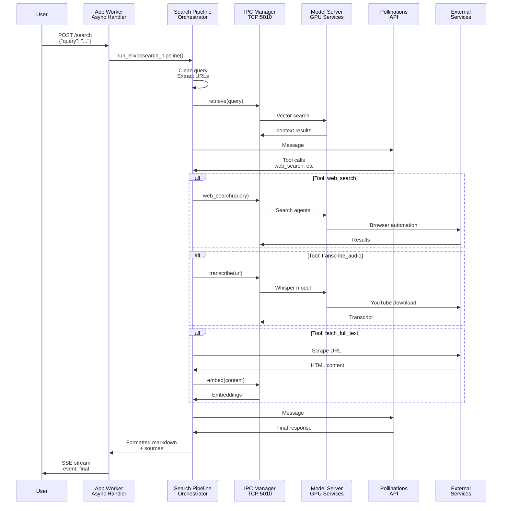

# 🔍 lixSearch - Your Intelligent Search Assistant

> **Smart searching made simple. Ask a question, get answers with sources.**

lixSearch is your personal research assistant that searches the web, watches videos, finds images, and synthesizes everything into clear, easy-to-read answers. Just ask, and get back thoughtfully researched results with sources you can trust.


---

## ✨ What Makes lixSearch Different?

### 🚀 Lightning Fast Responses
Don't wait for search results. lixSearch remembers what you've already asked about and serves up answers instantly from its memory. Same question, instant answer.

### 🧠 Actually Smart Search
Unlike regular search engines, lixSearch understands what you're really asking for. It searches the web, watches YouTube videos, analyzes images, and pieces everything together into a coherent answer.

### 📚 Always Shows Its Work
Every answer comes with sources. Read the original articles, watch the videos, see exactly where the information came from. No fluff, no guessing.

### 🎯 Learns Your Context
Ask a follow-up question and lixSearch remembers what you were just talking about. It's like chatting with someone who actually paid attention to the conversation.

---

## 🎬 How It Works (In Plain English)

When you ask lixSearch a question, here's what happens behind the scenes:

1. **You Ask** - Type your question naturally, like you're talking to a friend
2. **We Understand** - lixSearch breaks down your question into its key parts
3. **We Search** - Multiple search agents fan out across the web, YouTube, and images simultaneously
4. **We Read** - Automatically extract the important information from articles and videos
5. **We Synthesize** - An AI reads through everything and writes a clear, concise answer
6. **You Get Results** - A beautifully formatted answer with clickable sources and relevant images


---

## 💡 Real-World Use Cases

### Research Paper ?
Ask about any topic and get a comprehensive overview with sources you can trust.

### Planning a Trip 📍 
Get real-time info about places, hotels, activities, and travel tips all in one place.

### Learning Something New 🎓
Follow-up questions are answered in context. The assistant remembers your conversation.

### Staying Updated 📰
Ask about the latest news on any topic and get today's results with sources.


---

## 🏗️ How The System Works (The Simple Version)

Imagine lixSearch as a research assistant with superpowers:

```
You Ask a Question
        ↓
The System Understands What You Mean
        ↓
Multiple Searchers Look for Answers (simultaneously)
  ├─ Web pages
  ├─ YouTube videos
  └─ Images
        ↓
All Information Gets Analyzed
        ↓
An AI Writes a Clear Answer
        ↓
You Get a Result with Sources
```

**Result:** Fast, accurate answers you can trust.


---

## ⚡ Key Capabilities

### 🔍 **Instant Answers**
Answers that come to you in real-time as they're being written.

### 💾 **Smart Memory**
The system learns from your searches and serves cached results instantly for repeat questions.

### 🎥 **Video Content Included**
Get summaries and transcripts from YouTube videos automatically.

### 🖼️ **Visual Results**
Relevant images are found and included with your answers.

### 📝 **Always Sourced**
Every answer includes links to where the information came from.

### 💬 **Natural Conversation**
Ask follow-up questions and the system remembers what you were discussing.

---

## System Flow: Request to Response



---

## Key Architectural Components

### 1. **🚀 Async Request Processing**
- Non-blocking async handlers using Quart
- Asyncio-based event loop for concurrent operations
- Thread pool executor for blocking I/O operations (only when necessary)
- Max 15 concurrent operations with semaphore control

### 2. **🧠 GPU-Optimized IPC Embedding**
- Single embedding model instance on GPU
- SentenceTransformer with FAISS indexing
- Thread-safe operations with lock management
- Automatic batch processing for efficiency

### 3. **🌐 Browser Automation Pool**
- Playwright-based search agents
- Automatic rotation after 20 tabs per agent
- Dynamic port allocation (9000-19999)
- Headless mode for lower resource usage

### 4. **⚡ Semantic Caching System**
- TTL-based cache (default: 3600 seconds)
- Cosine similarity matching (threshold: 0.90)
- Per-URL cache management
- Automatic expired entry cleanup

### 5. **💾 Session-Based Knowledge Management**
- Per-user session with independent FAISS indexes
- Conversation history tracking
- Content embeddings for relevance scoring
- Automatic memory summarization

### 6. **📊 Tool Orchestration**
Tools are executed via the LLM agent which chooses:
- `cleanQuery` - Extract & validate URLs from query
- `web_search` - Search the web for information
- `fetch_full_text` - Scrape and embed web content
- `image_search` - Find relevant images (async)
- `youtubeMetadata` - Extract video metadata
- `transcribe_audio` - Convert video to text
- `get_local_time` - Timezone lookups
- `generate_prompt_from_image` - Vision-based search
- `replyFromImage` - Direct image queries

---

## File Structure

### Core Modules

| File | Purpose | Key Classes |
|------|---------|-------------|
| **app.py** | Main Quart API server | FastAPI routes, initialization |
| **searchPipeline.py** | Tool orchestration + LLM interaction | `run_elixposearch_pipeline()` |
| **rag_engine.py** | RAG pipeline & retrieval | `RAGEngine`, `RetrievalSystem` |
| **model_server.py** | IPC embedding/transcription server | `CoreEmbeddingService`, port manager |
| **embedding_service.py** | SentenceTransformer wrapper | `EmbeddingService`, `VectorStore` |
| **session_manager.py** | Per-user context management | `SessionManager`, `SessionData` |
| **chat_engine.py** | Conversational response generation | `ChatEngine` |
| **semantic_cache.py** | Query result caching | `SemanticCache` |

### Utility Modules

| File | Purpose |
|------|---------|
| **utility.py** | Web search, image search, URL cleaning |
| **search.py** | Web scraping utilities |
| **getYoutubeDetails.py** | YouTube metadata & transcription (IPC) |
| **transcribe.py** | Standalone audio transcription client |
| **getImagePrompt.py** | Vision-language model for image queries |
| **getTimeZone.py** | Timezone/location utilities |
| **tools.py** | Tool definitions for LLM |
| **instruction.py** | System/user/synthesis prompts |
| **config.py** | Configuration constants |
| **requestID.py** | Request tracking middleware |
