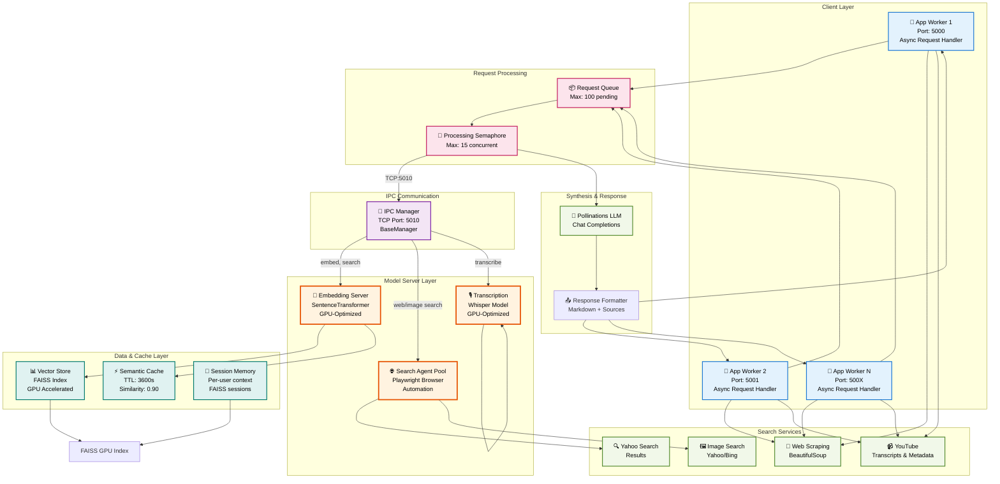
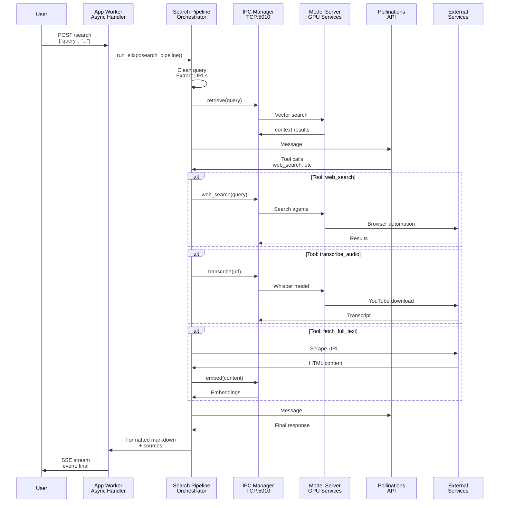

# Elixpo Search Agent


A Python-based web search and synthesis API that processes user queries, performs web and YouTube searches, scrapes content, and generates detailed Markdown answers with sources and images. Built for extensibility, robust error handling, and efficient information retrieval using modern async APIs and concurrency.

**NEW: Now features an IPC-based embedding model server for optimized GPU resource usage and better scalability!**

---

### GPU Memory Optimization (IPC Architecture):
```
Legacy Model (Before IPC):
App Worker 1 → Local Embedding Model (GPU: ~1GB)
App Worker 2 → Local Embedding Model (GPU: ~1GB)  
App Worker 3 → Local Embedding Model (GPU: ~1GB)
Total: ~6GB GPU memory per 3 workers

Optimized Model (With IPC):
App Worker 1 ──┐
App Worker 2 ──┤→ IPC TCP → Embedding Server (GPU: ~2GB)
App Worker 3 ──┘
Total: ~2GB GPU memory (67% reduction!)
```

---

## Architecture Overview

The system uses an **IPC-based Inter-Process Communication architecture** with async task processing, semantic caching, and efficient resource pooling:



---

## System Flow: Request to Response



---

## Key Architectural Components

### 1. **🚀 Async Request Processing**
- Non-blocking async handlers using Quart
- Asyncio-based event loop for concurrent operations
- Thread pool executor for blocking I/O operations (only when necessary)
- Max 15 concurrent operations with semaphore control

### 2. **🧠 GPU-Optimized IPC Embedding**
- Single embedding model instance on GPU
- SentenceTransformer with FAISS indexing
- Thread-safe operations with lock management
- Automatic batch processing for efficiency

### 3. **🌐 Browser Automation Pool**
- Playwright-based search agents
- Automatic rotation after 20 tabs per agent
- Dynamic port allocation (9000-19999)
- Headless mode for lower resource usage

### 4. **⚡ Semantic Caching System**
- TTL-based cache (default: 3600 seconds)
- Cosine similarity matching (threshold: 0.90)
- Per-URL cache management
- Automatic expired entry cleanup

### 5. **💾 Session-Based Knowledge Management**
- Per-user session with independent FAISS indexes
- Conversation history tracking
- Content embeddings for relevance scoring
- Automatic memory summarization

### 6. **📊 Tool Orchestration**
Tools are executed via the LLM agent which chooses:
- `cleanQuery` - Extract & validate URLs from query
- `web_search` - Search the web for information
- `fetch_full_text` - Scrape and embed web content
- `image_search` - Find relevant images (async)
- `youtubeMetadata` - Extract video metadata
- `transcribe_audio` - Convert video to text
- `get_local_time` - Timezone lookups
- `generate_prompt_from_image` - Vision-based search
- `replyFromImage` - Direct image queries

---

## File Structure

### Core Modules

| File | Purpose | Key Classes |
|------|---------|-------------|
| **app.py** | Main Quart API server | FastAPI routes, initialization |
| **searchPipeline.py** | Tool orchestration + LLM interaction | `run_elixposearch_pipeline()` |
| **rag_engine.py** | RAG pipeline & retrieval | `RAGEngine`, `RetrievalSystem` |
| **model_server.py** | IPC embedding/transcription server | `CoreEmbeddingService`, port manager |
| **embedding_service.py** | SentenceTransformer wrapper | `EmbeddingService`, `VectorStore` |
| **session_manager.py** | Per-user context management | `SessionManager`, `SessionData` |
| **chat_engine.py** | Conversational response generation | `ChatEngine` |
| **semantic_cache.py** | Query result caching | `SemanticCache` |

### Utility Modules

| File | Purpose |
|------|---------|
| **utility.py** | Web search, image search, URL cleaning |
| **search.py** | Web scraping utilities |
| **getYoutubeDetails.py** | YouTube metadata & transcription (IPC) |
| **transcribe.py** | Standalone audio transcription client |
| **getImagePrompt.py** | Vision-language model for image queries |
| **getTimeZone.py** | Timezone/location utilities |
| **tools.py** | Tool definitions for LLM |
| **instruction.py** | System/user/synthesis prompts |
| **config.py** | Configuration constants |
| **requestID.py** | Request tracking middleware |
