# ElixpoSearch API Architecture

## System Overview

```mermaid
graph TB
    subgraph Client["Client Layer"]
        HTTP[HTTP/REST Client]
        WS[WebSocket Client]
    end

    subgraph API["Main API Server - app.py"]
        APP[Quart App Instance]
        ROUTES["API Routes<br/>- /api/search<br/>- /api/chat<br/>- /api/session/*<br/>- /ws/search"]
        MIDDLEWARE["Middleware<br/>- RequestID Middleware<br/>- CORS<br/>- Validation"]
        STARTUP["Startup Handler<br/>- Initializes Services<br/>- Starts IPC Service"]
        SHUTDOWN["Shutdown Handler<br/>- Graceful cleanup"]
    end

    subgraph IPC["IPC Service (subprocess)"]
        CORE_SVC["CoreEmbeddingService"]
        SEARCH_AGENT["SearchAgents Manager"]
        EMBEDDINGS["Vector Store<br/>Chroma DB"]
        SEMANTIC["Semantic Cache"]
    end

    subgraph Pipeline["Pipeline Runner"]
        SEARCH_PIPE["SearchPipeline<br/>run_elixposearch_pipeline"]
        TOOLS["Tool Definitions<br/>web_search, fetch_full_text,<br/>image_search, etc."]
        INSTRUCTIONS["System Instructions<br/>Role definitions,<br/>Tool guidance"]
        CONFIG["Pipeline Config<br/>Model settings,<br/>API endpoints"]
    end

    subgraph Session["Session Management"]
        SESSION_MGR["SessionManager<br/>- CRUD operations<br/>- TTL management<br/>- Conversation history"]
        SESSION_DATA["SessionData<br/>- Query embedding<br/>- Content storage<br/>- Metadata"]
        SESSION_MEM["SessionMemory<br/>- Memory management"]
    end

    subgraph RAG["RAG Service"]
        RETRIEVAL_SYS["RetrievalSystem<br/>- Singleton pattern<br/>- Engine factory"]
        RAG_ENGINE["RAGEngine<br/>- Context retrieval<br/>- Semantic caching"]
        EMBED_SVC["EmbeddingService<br/>- Model inference"]
        VECTOR_STORE["VectorStore<br/>- Chroma wrapper<br/>- CRUD operations"]
        CACHE["SemanticCache<br/>- Similarity-based<br/>caching"]
    end

    subgraph Chat["Chat Engine"]
        CHAT_ENGINE["ChatEngine<br/>- Contextual responses<br/>- Search integration"]
        CHAT_INIT["Chat Initializer<br/>- Setup handlers"]
    end

    subgraph Search["Searching Service"]
        SEARCH_UTILS["Searching Utils<br/>- Web/Image search<br/>- URL validation<br/>- Playwright integration"]
        FETCH["fetch_full_text<br/>- Web scraping<br/>- Content extraction"]
    end

    subgraph FunctionCalls["Function Modules"]
        IMG_PROMPT["getImagePrompt<br/>- Vision-language model<br/>- Image analysis"]
        IMG_REPLY["replyFromImage<br/>- Image-based responses"]
        YT["getYoutubeDetails<br/>- Metadata extraction<br/>- Audio transcription"]
        TZ["getTimeZone<br/>- Location resolution<br/>- Timezone lookup"]
    end

    subgraph Commons["Commons & Utilities"]
        SEARCHING_BASED["searching_based<br/>- Web search wrapper<br/>- Image search wrapper"]
        REQUEST_ID["RequestID Middleware<br/>- Request tracking"]
        MAIN["Main utilities<br/>- IPC manager"]
    end

    %% Connections
    HTTP --> APP
    WS --> APP
    
    APP --> ROUTES
    APP --> MIDDLEWARE
    APP --> STARTUP
    APP --> SHUTDOWN
    
    STARTUP -->|starts subprocess| IPC
    STARTUP -->|Get Sessions| SESSION_MGR
    STARTUP -->|Initialize| RETRIEVAL_SYS
    STARTUP -->|Setup| CHAT_ENGINE
    
    ROUTES -->|fetch_search_results| SEARCH_PIPE
    ROUTES -->|fetch_chat| CHAT_ENGINE
    ROUTES -->|manage_sessions| SESSION_MGR
    ROUTES -->|fetch_context| RETRIEVAL_SYS
    
    SEARCH_PIPE -->|use_tools| TOOLS
    SEARCH_PIPE -->|apply_instructions| INSTRUCTIONS
    SEARCH_PIPE -->|config_settings| CONFIG
    SEARCH_PIPE -->|fetch_content| SEARCH_UTILS
    SEARCH_PIPE -->|call_functions| FunctionCalls
    SEARCH_PIPE -->|retrieve_context| RAG_ENGINE
    
    CHAT_ENGINE -->|get_sessions| SESSION_MGR
    CHAT_ENGINE -->|retrieve_context| RETRIEVAL_SYS
    CHAT_ENGINE -->|use_pipeline| SEARCH_PIPE
    
    SESSION_MGR -->|manage| SESSION_DATA
    SESSION_MGR -->|manage| SESSION_MEM
    
    RETRIEVAL_SYS -->|create_engines| RAG_ENGINE
    RAG_ENGINE -->|embed_queries| EMBED_SVC
    RAG_ENGINE -->|store_vectors| VECTOR_STORE
    RAG_ENGINE -->|cache_results| CACHE
    RAG_ENGINE -->|use_session_data| SESSION_DATA
    
    RAG_ENGINE -->|connect_to_core| CORE_SVC
    RAG_ENGINE -->|search_vectors| EMBEDDINGS
    RAG_ENGINE -->|cache_results| SEMANTIC
    
    SEARCH_UTILS -->|use_IPC| SEARCH_AGENT
    SEARCHING_BASED -->|wrap_search| SEARCH_UTILS
    SEARCH_UTILS -->|validate_urls| FETCH
    FETCH -->|fetch_from_urls| SEARCH_UTILS
    
    FunctionCalls -->|analyze| IMG_PROMPT
    FunctionCalls -->|reply| IMG_REPLY
    FunctionCalls -->|extract_metadata| YT
    FunctionCalls -->|lookup| TZ
    
    IPC -->|serve_embeddings| CORE_SVC
    IPC -->|manage_agents| SEARCH_AGENT
    CORE_SVC -->|persist| EMBEDDINGS
    CORE_SVC -->|cache| SEMANTIC

    %% Styling
    classDef client fill:#e1f5ff,stroke:#01579b,stroke-width:2px
    classDef api fill:#fff3e0,stroke:#e65100,stroke-width:2px
    classDef service fill:#f3e5f5,stroke:#4a148c,stroke-width:2px
    classDef pipeline fill:#e8f5e9,stroke:#1b5e20,stroke-width:2px
    classDef util fill:#fce4ec,stroke:#880e4f,stroke-width:2px

    class Client client
    class API api
    class IPC,Pipeline,Session,RAG,Chat,Search,FunctionCalls service
    class Commons util
```



## Module Hierarchies

### Directory Structure
```
api/
├── app.py                  # Main entry point, route handlers, startup/shutdown
├── pipeline/               # Search pipeline and LLM orchestration
│   ├── searchPipeline.py   # Main pipeline runner
│   ├── tools.py            # Tool definitions for LLM
│   ├── instruction.py      # System/user/synthesis prompts
│   └── config.py           # Configuration constants
├── ipcService/             # IPC service (runs in subprocess)
│   ├── main.py             # Service entry point
│   ├── coreEmbeddingService.py  # Core embedding operations
│   ├── searchPortManager.py     # Search agent management
│   └── sessionManager.py        # Session-specific IPC operations
├── sessions/               # Session management
│   ├── session_manager.py  # Global session manager
│   ├── sessionData.py      # Per-session data container
│   └── sessionMemory.py    # Session memory operations
├── ragService/             # RAG (Retrieval-Augmented Generation)
│   ├── ragEngine.py        # Main RAG engine
│   ├── retrievalSystem.py  # Singleton retrieval system
│   ├── embeddingService.py # Embedding model wrapper
│   ├── vectorStore.py      # Vector store wrapper (Chroma)
│   ├── semanticCache.py    # Semantic similarity caching
│   └── retrievalPipeline.py    # Retrieval orchestration
├── chatEngine/             # Chat functionality
│   ├── chat_engine.py      # Main chat engine
│   └── main.py             # Chat initialization
├── commons/                # Shared utilities
│   ├── searching_based.py  # Web/image search wrappers
│   ├── main.py             # IPC manager initialization
│   └── requestID.py        # Request tracking middleware
├── functionCalls/          # LLM function implementations
│   ├── getImagePrompt.py   # Image analysis via vision model
│   ├── getYoutubeDetails.py # YouTube metadata & transcription
│   └── getTimeZone.py      # Timezone/location utilities
└── searching/              # Web searching and scraping
    ├── fetch_full_text.py  # URL content extraction
    ├── main.py             # Searching service utils
    └── utils.py            # Playwright & validation
```

## Key Design Patterns

### 1. IPC Service Pattern
- **ipcService**: Runs as a separate subprocess
- **Why**: Heavy operations (embedding, transcription) run isolated
- **Startup**: app.py spawns ipcService as subprocess on startup
- **Communication**: Model server client manages connection

### 2. Singleton Patterns
- **RetrievalSystem**: One instance per application
- **SessionManager**: One global instance
- **ChatEngine**: One global instance
- **Ensures**: Proper resource management and consistency

### 3. Session-Based Architecture
- Each query creates a SessionData object
- Stores embeddings, fetched content, metadata
- RAGEngine manages per-session vector stores
- SemanticCache reduces redundant computations

### 4. Tool-Based LLM Interaction
- Tools defined in `pipeline/tools.py`
- System instructions in `pipeline/instruction.py`
- Pipeline manages tool calling sequence
- Results integrated back into context

## Import Dependencies

### Core Import Graph
```
app.py
├── pipeline.searchPipeline
├── sessions.session_manager
├── ragService.ragEngine
├── chatEngine.chat_engine
└── commons.requestID

searchPipeline.py
├── pipeline.tools
├── pipeline.instruction
├── pipeline.config
├── pipeline.functionCalls.*
├── commons.searching_based
└── ragService.semanticCache

ragEngine.py
├── ragService.embeddingService
├── ragService.vectorStore
├── ragService.semanticCache
└── sessions.sessionData

chatEngine.py
├── pipeline.config
└── (dynamic session/retrieval calls)

Commons modules
├── commons.main (IPC initialization)
└── searching.fetch_full_text
```

## Startup Sequence

1. **app.py main** starts
2. **@app.before_serving** triggers:
   - Calls `_start_ipc_service()` → spawns ipcService subprocess
   - Waits 2 seconds for IPC to be ready
   - Initializes SessionManager
   - Initializes RetrievalSystem
   - Initializes ChatEngine
3. **Quart listens** on 0.0.0.0:8000
4. **Ready** for requests

## Shutdown Sequence

1. Quart receives shutdown signal
2. **@app.after_serving** triggers:
   - Terminates IPC service process gracefully
   - Falls back to SIGKILL if timeout
   - Cleans up resources

## Request Flow Example (Search)

```
POST /api/search
→ _validate_query()
→ run_elixposearch_pipeline()
  → get_model_server() (connects to IPC)
  → Iterative loop:
    - Send user query to LLM
    - LLM suggests tools (web_search, fetch_full_text, image_search)
    - Execute tools in parallel
    - Fetch and embed results
    - Update RAG context
    - Send response chunks via SSE
→ Return results
```

## Configuration Management

All configuration centralized in `pipeline/config.py`:
- Model endpoints (Pollinations API)
- Embedding settings (dimension, model)
- RAG settings (cache TTL, similarity threshold)
- Search settings (max results, timeouts)
- Session settings (TTL, max sessions)

